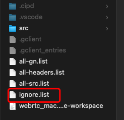

# fastfind
## 1. [Screenshot]


Have a fun!~~

<br />

## 2. [Background]

It's a tool designed for C++ symbol find based on shell. 

It works under:

- git-bash shell on Windows 
- zsh on Mac.

Maybe it can fit other shell-env, but not test is performed

The idea of this tools comes from the terrible experience in using vs-code on WebRTC source code. There is no symbol colorful highlight, and no category in search result in vs-code. There are always so many results when search, so that you need to take too much time to find the focus you really care about.  And also on Mac, the IntelliSense and C++ extension does not work well as you expect, the performance on Mac can not be endured. 

This tool is designed to show respect to the visual assist which is the powerful extension of visual studio for C++ on Windows.

You can use command "ffse-help" to get some help. 

For historical reason, there are something named with "ffse" which means "fast-find-symbol extension", and now it's the 3rd version, so you can find something with the name "FF3_XXX" or "FFSE" in the shell script. Don't be surprised when you see those names.......

<br />

## 3. [Tool Init]

To init the tool, just:

1. put the ".fast_symbol_finder3.sh" in your home directory. To get your home directory, you can use:

```shell
#on windows 
echo %USERPROFILE%

#on mac
echo $HOME
```

2. then go to the webrtc "src" directory

3. run the init command:

```shell
ffse-init
```

"ffse-init" will prepare all the source file lists, used by fastfind, except for the "ignore.list". "ignore.list" is a list customized by your self. Refer to chapter 7.1 in this readme for more info on "ignore.list". You can also use the "ignore.list" in the directory of [ref_list](https://github.com/gimphammer/fastfind/tree/master/ref_list), if you are working with the M97 of WebRTC. And put it under the WebRTC root directory like this:



<br />

## 4. [Command usage]

### 4.1 Basic Command

- fc [symbol]  -- to find where the symbol is used, or the function is called

- fs [symbol] -- find all symbol in code base, not only where it is used, but also where it is defined. it can be function name, or var-name

- fdd [class-name] -- find all the class derived from the class named by [class-name], 

- fdc [class-name] -- find who is the father class for  [class-name]

- ff [symbol]  [file-in-relative-path] -- find all the symbol named by [symbol] in the [file-in-relative-path] 

- fg [symbol] -- find [symbol] in *.gn and *.gni file.  use this command to find something and analyze the WebRTC make-system

The commands listed above: some are alias commands and some are original defined name in shell-script.

Many of the commands include filters internal, to filter something it does not care about to make the result as concise as possible. In most of the using case, we wanna find where the function is called, or where the variance is used, to achieve that, we need to filter the C++ domain symbol, comments, And "fc" is the one who includes most filter, 

Only "ff" is search the file you set at at command parameter, and other commands search the list initialized by "ffse-init".

"fdd" and "fdc" is usually used to analyze the hierarchy of class. Sometime they get the same result.

"fs" has the fewest filter. If you can not find what you want by "fc", you can try "fs". We someting

"fg" is command like the "fs", but only works on all the gn stuff


### 4.2 Used in VS-Code

vs-code has also integrated the shell-env, so you can run the fastfind in that env. But don't forget to choose the right shell-env which fastfind fits.

vs-code supply a candy: **[Ctrl + mouse left-click]** on fastfind's result will quick jump to the line where the target locates.

Hint like this:


Enjoy it!~~

<br />


## 5. [Something help you work more fluently]

### 5.1 Shortcuts

you can ignore the shortcuts listed here, but if you are familiar with shortcuts, you can work more fluently. 

| vs-code command ID                       |
| ---------------------------------------- |
| copyRelativeFilePath                     |
| workbench.action.terminal.toggleTerminal |
| (more to be added.....)                  |

the specific shortcuts depend on the platform you used or the configuration set by you

### 5.2 VS-Code Setting(for User)

```json
    "terminal.integrated.commandsToSkipShell": [
      "workbench.action.quickSwitchWindow",
      "workbench.action.closeSidebar",
      "workbench.action.quickOpenView",
      "workbench.action.gotoSymbol",
      "workbench.action.showAllSymbols"
    ],
    "terminal.integrated.rightClickBehavior": "paste",
    "terminal.integrated.copyOnSelection": true,
    "terminal.integrated.wordSeparators": "()[]{} ',\"`─‘’|<>.:-;/\\&*-~=",
```

you can just copy these JSON fregments to the user setting.json of vs-code

<br />

## 6. [What's you need to know]

Now, the tool is designed basing on the C++ code style similar to WebRTC, if in other code style, you can try it....

<br />

## 7. [Something about  Design] -- TL;DR

### 7.1 Why FastFind happened

the IDE has the features on code analysis, such as search, find defined, find reference, etc. On many scenarios these feature  work well, especially on the code base which is not Huge, but that dose not always happen on WebRTC. Of course you can reduce the project included in to narrow the search range, for example, just focus on the VCM module by open the only several projects. But the limits will follow that operation immediately.....

At first, I solve that problem by the `find` and `grep` and other command. But every time, I need to type a lot of words, and some time, I need to search the web on how to write the regular expression what I need.  And another issue that drive me crazy is the long time I need to wait to perform the these command due to the huge amount find I/O and grep process. WebRTC is huge, there are about 1-million files on the code base, but what I need is C++ source file which is only a small part of it, and also not all the C++ source file is what I need.....Actually, only about 4700 files are the ones what I need to care about, which is the core source of WebRTC exclude the third_party.

Yes, it's really sucks, that's not  the right way to do the right thing. What I want is just copy some keyword, and select the find-mode, then let something do it for me for the left. What's more, a colorful highlight should be presented in the result, and help me focus on what I need. Then the fastfind happened to the world...

The FastFind is based on the regular expression, not C++ syntax. Although there is few basic C++ syntax analysis included, but that's only for  fast implementation. 

### 7.2 About the List

There are several list used by the fastfind. As mentioned above, "ffse-init" will prepare all the list except for ignore.list. Here is some explanation on these list:

- **all-src.list** -- all source files of C++ code used to find the symbol you want. It includes all the *.h file and *.cc. But the source file in the directory of "third_party" is not included, because that's not the core source of webrtc. Anyway, you can modify the shell-script to let ffse-init to include the source file in "third_party"
- **all-header.list** -- you can ignore this list, it's a historical left
- **all-gn.list** -- all the *.gn and *.gni file used for "fg" command
- **ignore.list** -- For some historical reason, not all the source files are used for  the current WebRTC version. For example: jitter_buffer.h and jitter_buffer.cc is obsoleted in the M97, so when we do the code analysis, we need sweep the distraction item, and our focus right and precise as possible as we can.

### 7.3 About command name

The command names are designed to as short as possible. If there is any name confliction, you can redefine it as you want

### 7.4 Something internal

"fs" will exclude the comments starts from "//" as the same to "fc"，but "ff" does not act like that. Maybe "ff" will support that in the future. The comments between "/* */" is not excluded, because it's not the main comments style in WebRTC code.

For the current version of FastFind(v3), its implementation is based on git-grep which has a domain-belonged shown in the result. It can help to know  which function the result locates in. That is similar to the visual assistant on Windows. Anyway, a few part of the domain-belonged is not what you are repect, but that will not confuse you. As you use it more and more, you will find that mis-match can be ignored

### 7.5 Command Parameters

You can use the command without any parameter, and that manner will help you to find most of what you want.

When you use "fs" or "fc", the parameter of "-pm" will give some helpful info. "-pm" means "partial match". But I don't use this parameter very often. The basic command form shown in Chapter-4 can meets most of my find. 

Yes, there are many other parameters in the tool now. But them will be revealed later, because, you know, WTFD is real a time-job. 


### 7.x MORE TO BE ADDED.....

For more info, please refer to the tool's shell script.

<BR />


