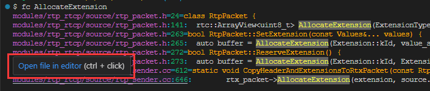
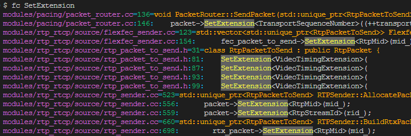
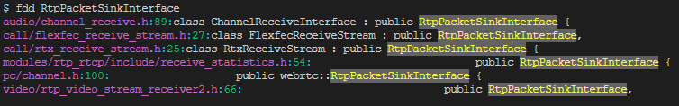
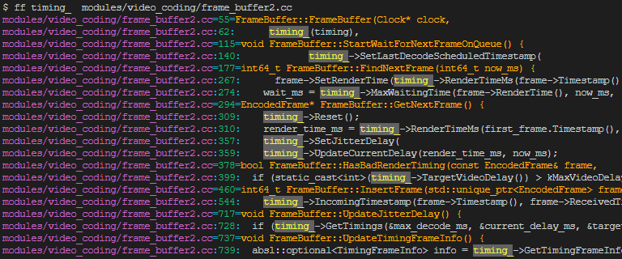

# fastfind
## 1. [Background]

It's a tool designed for C++ symbol find based on shell. 

It works under:

- git-bash shell on Windows 
- zsh on Mac. 

Maybe it can fit other shell-env, but not test is performed

The idea of this tools comes from the terrible experience in using vs-code on WebRTC source code. There is no symbol colorful highlight, and no category in search result on vs-code. There always so many results when use search, so that you need to take so many time to find the focus in the search result.  And also on Mac, the IntelliSense and C++ extension does not work well as you expect, the performance on Mac can not be endured. 

This tool is designed to show respect to the visual assist which is the powerful extension of visual studio for C++ on Windows.

You can use command "ffse-help" to get some help. 

For historical reason, there are something named with "ffse" which means "fast-find-symbol extension", and now it's the 3rd version, so you can find something with the name "FF3_XXX" or "FFSE" in the shell script, don't be suprised when see those name.......


## 2. [Tool Init]

To init the tool, just:

1. put the ".fast_symbol_finder3.sh" in your home directory. To get your home directory, you can use:

```shell
#on windows 
echo %USERPROFILE%

#on mac
echo $HOME
```

2. then go to the webrtc "src" directory

3. run the init command:

```shell
ffse-init
```

"ffse-init" will prepare all the source file lists, used by fastfind, except for the "ignore.list"


## 3. [Command usage]

### 3.1 Basic Command

- fc [symbol]  -- to find where the symbol is used, or the function is called

- fs [symbol] -- find all symbol in code base

- fdd [class-name] -- find all the class derived from the class named by [class-name]

- fdc [class-name] -- find who is the father class for  [class-name]

- ff [symbol]  [file-in-relative-path] -- find all the symbol named by [symbol] in the [file-in-relative-path] 


- fg [symbol] -- find [symbol] in *.gn and *.gni file

The commands listed above: some are alias commands and some are original defined name in shell-script.


### 3.2 Used in VS-Code

vs-code has also integrated the shell-env, so you can run the fastfind in that env. But don't forget to choose the right shell-env which fastfind fits.

vs-code supply a candy: **[Ctrl + mouse left-click]** on fastfind's result will quick jump to the line where the target locates.

Hint like this:



Enjoy it!~~


## 4. [Screenshot]







Have a fun!~~


## 5. [More help you work more fluent]

### 5.1 Shotcut

you can ignore the shotcuts listed here, but if you are famillar with shotcut, you can work more fluent. 

| vs-code command ID                       |
| ---------------------------------------- |
| copyRelativeFilePath                     |
| workbench.action.terminal.toggleTerminal |
| (more to be added.....)                  |

the specific shotcuts depend on the platform you used or the configuration set by you


### 5.2 VS-Code Setting(User)

```json
    "terminal.integrated.commandsToSkipShell": [
      "workbench.action.quickSwitchWindow",
      "workbench.action.closeSidebar",
      "workbench.action.quickOpenView",
      "workbench.action.gotoSymbol",
      "workbench.action.showAllSymbols"
    ],
    "terminal.integrated.rightClickBehavior": "paste",
    "terminal.integrated.copyOnSelection": true,
    "terminal.integrated.wordSeparators": "()[]{} ',\"`─‘’|<>.:-;/\\&*-~=",
```


## 6. [What's you need to know]

Now, the tool is designed basing on the C++ code style similar to WebRTC, if in other code style, you can try it....


## 7. [Something about  Design] -- TL;DR

There are several list used by the fastfind. As mentioned above, "ffse-init" will prepare all the list except for ignore.list. Here is some explanation on these list:

### 7.1 About list:

- **all-src.list** -- all source files of C++ code used to find the symbol you want. It includes all the *.h file and *.cc. But the source file in the directory of "third_party" is not included, because that's not the core source of webrtc. Anyway, you can modify the shell-script to let ffse-init to include the source file in "third_party"
- **all-header.list** -- you can ignore this list, it's a historical left
- **all-gn.list** -- all the *.gn and *.gni file used for "fg" command
- **ignore.list** -- For some historical reason, not all the source files are used for  the current WebRTC version. For example: jitter_buffer.h and jitter_buffer.cc is obsoleted in the M97, so when we do the code analysis, we need sweep the distraction item, and our focus right and precise as possible as we can.

### 7.2 About command name:

The command names are designed to as short as possible. If there is any name confliction, you can redefine it as you want

### Something internal:

"fs" will exclude the comments starts from "//" as the same to "fc"，but "ff" does not act like that. Maybe "ff" will support that in the future. The comments between "/* */" is not excluded, because it's not the main comments style in WebRTC code.

### 7.x MORE TO BE ADDED.....

For more info, please ref to the tool's shell script
